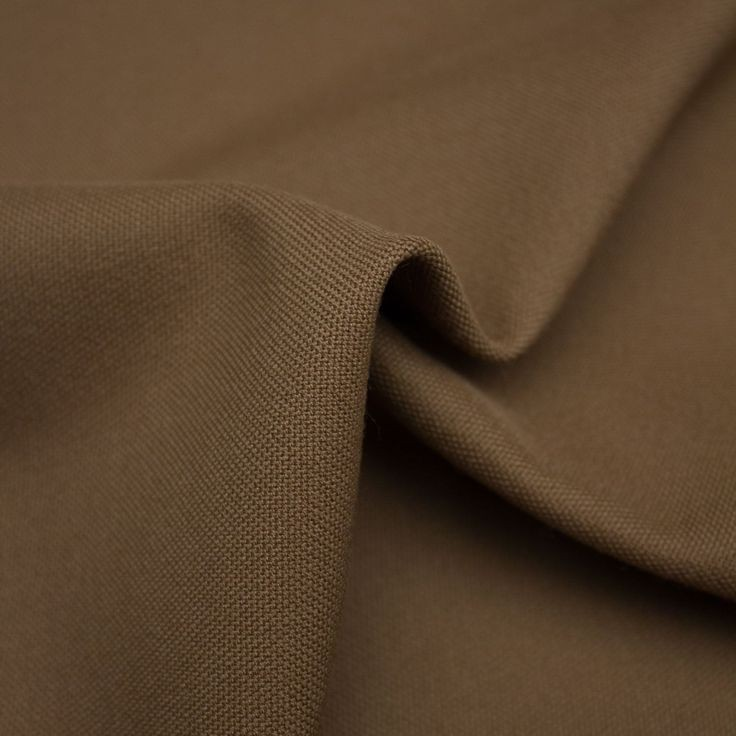
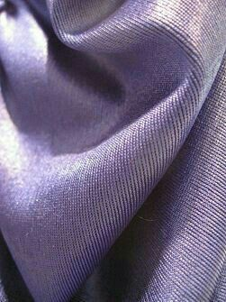
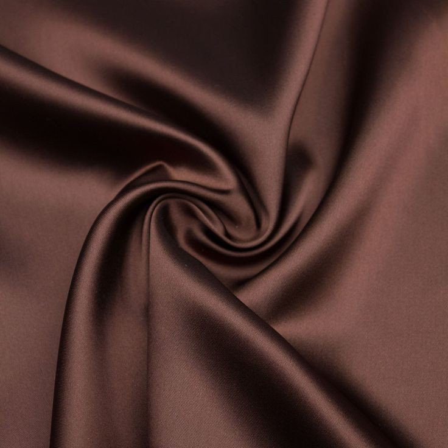
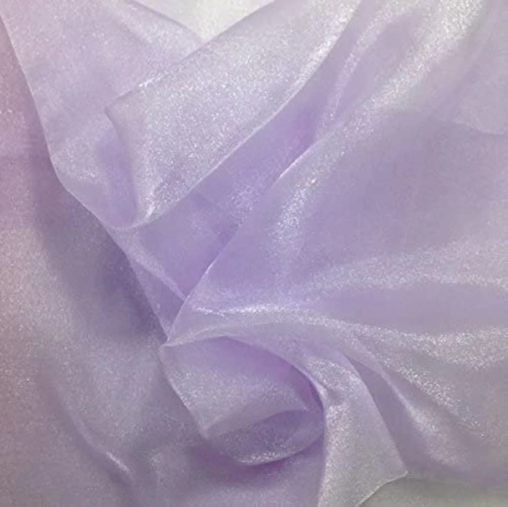
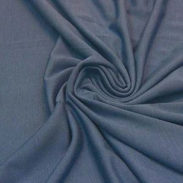

Spesifikasi Kebutuhan Perangkat
Lunak
Untuk
Website HIJABISTA INSIGHTS
Hijab Fashion and Hijab Consultation
Versi 1.0 disetujui
Disusun Oleh:
Septi Isdayanna	(22091397045)
Resti Divana Putri	(22091397060)
Eva Fitria Novianti Putri	(22091397068)
D4 Manajemen Informatika
Fakultas Vokasi
Universitas Negeri Surabaya Tahun 2023


1.	Pendahuluan
   
1.1	Tujuan Penulisan Dokumen
Dokumen Spesifikasi Kebutuhan Perangkat Lunak (SKPL) ini bertujuan sebagai panduan atau acuan baik bagi pengembang sistem maupun pengguna. Bagi pihak pengembang, dokumen ini berperan sebagai pedoman dasar yang membantu dalam perencanaan dan pelaksanaan aktivitas pengujian sistem, serta memberikan arahan untuk melakukan perbaikan dan perubahan pada sistem guna memenuhi kebutuhan pengguna dan tujuan dari website itu sendiri. Sedangkan bagi pihak pengguna, dokumen ini digunakan untuk mencatat semua spesifikasi kebutuhan dari website yang dikembangkan dan harapan yang diinginkan. Dokumen ini disusun dengan tujuan untuk mendukung proses pembuatan spesifikasi sistem informasi yang berkaitan dengan rekomendasi model, warna, dan bentuk hijab yang sesuai dengan karakteristik pengguna. Pada prinsipnya, hasil analisis sistem informasi dengan rancangan ini, diuraikan sebagai sekumpulan proses yang terorganisasi secara hierarkis memberikan solusi dan menetapkan batasan masalah agar proyek tidak menyimpang terlalu jauh dari tujuan awal atau manfaat dari website yang akan dibangun.

1.2	Konvensi Dokumen
Standar penulisan dokumen ini disesuaikan dengan template yang diberikan. Pada dokumen ini terdapat beberapa kata yang dicetak miring digunakan untuk menunjukan bahwa kata tersebut berasal dari bahasa asing, sedangkan penulisan dengan cetak tebal sebagai petunjuk memasuki bab atau sub bab baru dan tidak ada format khusus untuk menandai bagian terpenting dokumen.

1.3	Audiens yang Dituju dan Pembaca yang Disarankan
Audiens: Audiens yang dituju dari website ini adalah para wanita Muslim yang menggunakan hijab atau berencana untuk memulai mengenakan hijab. Wanita yang berminat dalam fashion dan hijab. Menyesuaikan hijab dari bentuk wajah dan warna kulit dan sebagai platform secara online untuk keperluan fashion. Beberapa dari mereka memiliki berbagai latar belakang dan tingkat pengalaman dalam memilih hijab.
Saran: Dokumen SKPL Website Hijabista Insights - Hijab Fashion and Hijab Consultation ini digunakan untuk menyediakan rekomendasi hijab yang cocok berdasarkan bentuk wajah dan warna kulit pengguna. Oleh karena itu, kami menyarankan kepada pembaca untuk membaca dokumen SKPL ini dengan seksama terlebih dahulu.

1.4	Lingkup Produk
Website ini berfungsi sebagai sebuah platform yang menyediakan berbagai rekomendasi mengenai hijab, termasuk model, warna, dan jenis bahan yang dapat disesuaikan dengan kebutuhan penggunanya. Untuk mencapai hal ini, website ini harus memiliki kemampuan untuk menampilkan berbagai kemungkinan pilihan bentuk wajah dan warna kulit, sehingga pengguna dapat menyesuaikan pilihan hijab sesuai dengan bentuk wajah dan warna kulit mereka. Dengan begitu, website ini dapat memberikan beberapa rekomendasi mengenai model dan warna hijab yang sesuai dengan preferensi pengguna. Selain itu, website ini juga harus mampu mengumpulkan data dari pengguna, dimana pengguna dapat memberikan informasi mengenai penggunaan hijab dalam kehidupan sehari-hari mereka. Hal ini akan memungkinkan website untuk memberikan rekomendasi mengenai jenis bahan hijab yang cocok untuk digunakan oleh pengguna tersebut. Setelah pengguna mendapatkan model, warna, dan bahan hijab yang sesuai, website ini juga harus mampu menampilkan rekomendasi beberapa toko online yang menjual hijab tersebut dengan berbagai macam harga. Hal ini bertujuan agar pengguna dapat membeli hijab tersebut dengan mudah. 

1.5	Referensi 
Dokumen-dokumen yang digunakan sebagai referensi dalam pembuatan SKPL ini adalah sebagai berikut:
[1]	“Spesifikasi Kebutuhan Perangkat Lunak Sistem Informasi Mahasiswa Berprestasi Universitas Palangka Raya.” [Online]. Available: https://www.researchgate.net/publication/365977478
[2]	“SPESIFIKASI KEBUTUHAN PERANGKAT LUNAK.”
[3]	H. Widyastuti, J. Siregar, and R. Ishak, “RANCANG BANGUN SISTEM INFORMASI PENJUALAN BAJU BERBASIS WEB,” 2020.
[4]	A. Oktavianti, W. Sugeng, and A. Agusta, “Implementasi Aplikasi Hijab Berbasis Android dengan Metode Canny Operator dan Template Matching Correlation”, [Online]. Available: http://myweb.lmu.edu/bjohnson/cmsi641web/week02-2.html
[5]	A. T. M. Anjungan, T. Mandiri, and M. Kuliah, “SPESIFIKASI KEBUTUHAN PERANGKAT LUNAK ATM (Anjungan Tunai Mandiri) BANK-XXX,” pp. 1–24.


2.	Deskripsi Keseluruhan
   
2.1	Perspektif Produk
Hijabista Insights: Hijab Fashion and Hijab Consultation" adalah platform interaktif yang dirancang untuk memberikan rekomendasi hijab yang sesuai dengan bentuk wajah dan warna  kulit dari pengguna dan juga memberikan rekomendasi bahan hijab yang sesuai dengan keseharian pengguna. Dengan desain dan isi yang menarik dan informatif, website ini digunakan untuk menyediakan rekomendasi hijab yang cocok berdasarkan bentuk wajah dan warna kulit pengguna, memfasilitasi pengguna untuk memilih bahan hijab sesuai dengan keperluan (sehari-hari atau acara khusus), serta mengarahkan pengguna ke toko online yang menjual hijab dengan pilihan harga berbeda.

2.2	Fungsi Produk
Website Hijab insights memiliki beragam fungsi yang bermanfaat, khususnya bagi para wanita yang memakai hijab dikesehariannya. Berikut adalah beberapa fungsi utama dari website ini:
Website ini memberikan rekomendasi berbagai model hijab kepada pengguna. Ini akan membantu pengguna dalam memilih model hijab yang sesuai dengan preferensi mereka.
Selain model, website ini juga memberikan rekomendasi berbagai warna hijab yang dapat disesuaikan dengan kebutuhan pengguna. Pengguna dapat memilih warna hijab yang cocok dengan warna kulit mereka atau sesuai dengan acara tertentu. Website ini memberikan rekomendasi mengenai bahan hijab yang sesuai dengan kebutuhan pengguna. Bahan hijab dapat beragam, seperti katun, satin, sutra, dll. Rekomendasi ini membantu pengguna dalam memilih bahan hijab yang nyaman dan sesuai dengan keperluan mereka. Website ini memberikan beberapa rekomendasi toko online yang menyediakan produk hijab sesuai dengan hasil analisis sistem. Beberapa di antaranya termasuk Shopee, Tokopedia, Lazada, Bukalapak, dan lainnya. Dengan fungsi-fungsi ini, website ini bertujuan untuk memberikan rekomendasi hijab yang lebih personal dan sesuai dengan preferensi serta kebutuhan pengguna.

2.3	Kelas dan Karakteristik Pengguna 
Analisis pengguna sistem dimaksudkan untuk mengetahui siapa saja aktor yang terlibat dalam menjalankan sistem. Sistem informasi aplikasi fasilitas umum ini sendiri menggunakan website. Pengguna sistem dibagi atas dua bagian, yaitu : 
1. Pengguna aplikasi fasilitas umum atau end user yaitu para pengguna website. Dalam menggunakan sistem ini, pengguna diharuskan memiliki koneksi GPRS / EDGE / UMTS / HSDPA dan fasilitas kamera untuk bisa menyesuaikan bentuk wajah mereka dengan hijab yang direkomendasikan. 
2. Admin sebagai pengelola konten secara keseluruhan memiliki fungsi- fungsi seperti menambah, mengubah dan menghapus konten informasi dalam menjalankan sistem. 

2.4	Lingkungan Operasi
Server Side
Perangkat yang kami gunakan adalah Windows sebagai Operating System (Sistem Operasi)
Client Side
Platform Pengguna
Platform ini dapat diakses melalui berbagai perangkat, termasuk komputer desktop, laptop, tablet, dan smartphone.
Browser yang Didukung
Platform akan dioptimalkan untuk berbagai browser populer termasuk Google Chrome, Mozilla Firefox, Safari, dan Microsoft Edge.
Development Tools
Perangkat yang digunakan untuk pengembangan sistem dan penyimpanan database adalah:
PhpMyAdmin sebagai sistem penyimpanan database Pengguna dan admin.
Bahasa pemrograman menggunakan PHP, JS, CSS, HTML.
Browser dan Development sebagai pengujian dan debug.

2.5	Kendala Desain dan Implementasi(belum)
Pengembangan sistem Hijab Insights ini memiliki keterbatasan-keterbatasan yaitu sebagai berikut:
Sistem yang dibangun belum terintegrasi secara utuh.
Keamanan website adalah hal yang penting. Pastikan untuk menginstal pembaruan keamanan secara berkala dan menggunakan alat keamanan yang sesuai untuk melindungi website dari serangan dan ancaman siber.
Sekalipun website telah dibangun, jika tidak dipromosikan dengan baik, mungkin akan kurang dikenal oleh masyarakat umum.

 2.6	Dokumentasi Pengguna
Berikut panduan penggunaan aplikasi bagi pengguna tentang fitur-fitur penting pada aplikasi berbasis website Hijabista Insights: 
1. Pilih Bentuk Wajah dan Warna Kulit:
Platform akan menggunakan kamera untuk mengidentifikasi dan menganalisis bentuk wajah dan warna kulit pengguna. Informasi ini akan menjadi dasar untuk merekomendasikan hijab yang sesuai.
2. Model Hijab yang Cocok:
Berdasarkan hasil analisis wajah dan warna kulit, platform akan menggunakan algoritma rekomendasi untuk menyarankan model hijab yang paling cocok.
3. Konsultasi Pengguna:
Pengguna akan diminta untuk memberikan informasi mengenai penggunaan hijab, apakah untuk kegiatan sehari-hari atau acara khusus. Data ini akan memengaruhi rekomendasi bahan hijab.
4. Rekomendasi Toko Online:
Setelah konsultasi selesai, platform akan menampilkan berbagai toko online yang menyediakan produk hijab sesuai dengan hasil analisis. Beberapa di antaranya termasuk Shopee, Tokopedia, Lazada, Bukalapak, dan lainnya.
5. Perbandingan Harga:
Pengguna akan dapat membandingkan harga produk hijab dari berbagai toko online, memungkinkan mereka untuk membuat pilihan berdasarkan preferensi dan anggaran mereka.
6. Pengalihan ke Aplikasi Toko:
Setelah pengguna memilih produk dan toko online, mereka akan dialihkan ke aplikasi toko terkait jika mereka ingin melakukan pembelian.

2.7	Asumsi dan Ketergantungan
Dalam pengembangan website Hijabista Insights - Hijab Fashion and Hijab Consultation, terdapat beberapa asumsi dan dependensi yang perlu dipertimbangkan. Asumsi dan Ketergantungan memberikan kerangka kerja untuk memahami kondisi dan ketergantungan yang mungkin mempengaruhi pengembangan dan operasionalisasi platform "Hijabista Insights". Memahami asumsi dan ketergantungan ini adalah kunci untuk mengelola risiko dan memastikan platform berfungsi sebagaimana mestinya.

Asumsi
1. Asumsi Umum
Pengguna memiliki akses internet stabil untuk mengakses platform.
2. Data Pengguna
Pengguna memberikan informasi yang akurat tentang bentuk wajah, warna kulit, dan preferensi pribadi untuk mendapatkan rekomendasi hijab yang akurat.
3. Keamanan Data
Tindakan keamanan yang memadai akan diimplementasikan untuk melindungi data pengguna dari akses tidak sah atau kebocoran.
4. Integrasi Toko Online
Pihak yang menyediakan API toko online memiliki sistem yang dapat diakses dan dokumentasi yang memadai untuk integrasi.
5. Ketersediaan Toko Online
Toko online yang diarahkan pengguna memiliki persediaan hijab yang mencukupi dan aktual.
6. Pembaruan dan Penyelenggaraan
Platform dapat diperbarui dan diselenggarakan tanpa gangguan signifikan terhadap pengguna.

Ketergantungan
1. Ketergantungan Eksternal
Platform mengandalkan API dari toko online mitra untuk menyediakan rekomendasi produk dan harga.
2. Pengembangan Bahasa Pemrograman
Ketersediaan sumber daya dan dukungan untuk bahasa pemrograman yang digunakan dalam pengembangan (PHP, HTML, CSS, JavaScript) harus dijamin.
3. Ketersediaan Server dan Hosting
Layanan hosting dan server harus stabil dan dapat diandalkan untuk menjalankan platform secara efisien.
4. Ketersediaan Database Management System
MySQL sebagai DBMS harus berfungsi dengan baik dan memenuhi kebutuhan platform.
5. Ketersediaan Teknologi Keamanan
Teknologi keamanan seperti SSL/TLS harus tersedia dan berfungsi dengan baik untuk melindungi data pengguna.
6. Integrasi Algoritma Rekomendasi
Algoritma rekomendasi harus dapat diintegrasikan dengan platform dan berjalan dengan akurat berdasarkan data pengguna.


3.	Kebutuhan Antarmuka Eksternal
   
3.1	Antarmuka Pengguna
Aplikasi ini  menggunakan antarmuka berbasis web, dan pengguna mengoperasikannya dengan menggunakan keyboard dan mouse di sistem operasi windows. Pengguna utama aplikasi ini adalah semua wanita yang memakai hijab, yang memiliki tingkat kemampuan bervariasi dalam menggunakan aplikasi tersebut. oleh karena itu, aplikasi ini dirancang dengan konsep desain yang ramah untuk pengguna. Aksesnya cukup mudah dan pengguna tidak akan kesulitan dalam berpindah halaman. Warna-warna yang digunakan dalam aplikasi ini dibuat dengan hangat sehingga nyaman bagi pengguna dalam pemilihan hijab. 

3.2	Antarmuka Perangkat Keras
Aplikasi ini dapat diakses dengan menggunakan beberapa perangkat keras seperti mouse sebagai pointer, keyboard sebagai tombol input, dan yang terpenting yaitu handphone atau laptop untuk mengakses aplikasi dengan terhubung ke internet. Kecepatan aplikasi berbasis website ini pada saat digunakan tergantung pada juga kecepatan internet yang digunakan dan kondisi perangkat. 

3.3	Antarmuka Perangkat Lunak
Aplikasi diakses menggunakan web browser.
Dikembangkan menggunakan bahasa pemrograman html, css, java script.
Database yang digunakan adalah mysql.
3.4	Antarmuka Komunikasi
website ini memerlukan perangkat berupa laptop, PC, atau smartphone yang terhubung ke jaringan internet. Aplikasi ini dapat dijalankan melalui web browser Google Chrome dan menggunakan formulir elektronik HTML untuk mengumpulkan data dari pengguna dengan batasan maksimal 1000 kata. Komunikasi data dalam proses pertukaran informasi antar perangkat yang terhubung dalam jaringan menggunakan protokol jaringan berbasis TCP/IP sebagai standar komunikasi jaringan.


4.    	Fitur Sistem dan Kerangka Desain Fitur
   
4.1 


5.  	Persyaratan Non Fungsional Lainnya
   
5.1	Persyaratan Kinerja
Persyaratan kinerja yang harus dipenuhi untuk memastikan performa dan responsivitas yang baik dari Website Hijab Insight, sebagai berikut:
Waktu Respon Halaman
Setiap halaman website harus dimuat dalam waktu maksimum 2 detik.
Waktu tunda saat menavigasi antar halaman dalam website harus kurang dari 1 detik.
Responsifitas Desain
- Website harus merespons dengan baik pada berbagai perangkat, termasuk desktop, tablet, dan ponsel.
Kecepatan Pencarian
 - Website harus menghasilkan hasil pencarian yang relevan dengan cepat.
Kecepatan Loading Gambar
- Gambar harus dikompres dengan baik untuk meminimalkan waktu pemuatan halaman.
Kapasitas Pengguna
Website harus mampu menangani jumlah pengguna yang berinteraksi secara bersamaan tanpa mengalami penurunan kinerja yang signifikan.
Kinerja pada jaringan lambat
Website harus dapat diakses dengan baik pada koneksi berkecepatan rendah tanpa mengorbankan kualitas konten.

5.2	Persyaratan Keselamatan
Website Hijabista Insights - Hijab Fashion and Hijab Consultation memberikan tindakan keamanan yang akan diimplementasikan. Keamanan data pengguna, transmisi, dan integrasi keamanan adalah prioritas utama. Perlindungan privasi dan ketersediaan layanan juga merupakan fokus penting. Pembaruan dan pemeliharaan keamanan secara teratur adalah bagian integral dari strategi keamanan keseluruhan. Dengan mengimplementasikan langkah-langkah ini, kami bertujuan untuk memberikan pengalaman pengguna yang aman dan terpercaya.

5.3	Persyaratan Keamanan
Persyaratan keamanan website hijab insights  sangat penting untuk melindungi data dari pengguna, mencegah ancaman siber, serta menjaga integritas dan ketersediaan website. Berikut adalah beberapa persyaratan keamanan yang perlu dipertimbangkan dalam pengembangan dan pengelolaan website tersebut:
Proteksi Data Pengguna
Website harus memiliki mekanisme enkripsi data (HTTPS) untuk melindungi data pribadi dan sensitif pengguna, seperti informasi penggunaan hijab untuk keseharian user yang seperti apa.
Manajemen Akses yang Tepat
Hanya pengguna yang sah dan berwenang yang harus memiliki akses ke bagian-bagian tertentu dari website, seperti data pribadi atau informasi penting lainnya.
Pemantauan Keamanan
Website harus memantau keamanan yang memungkinkan deteksi cepat terhadap aktivitas mencurigakan atau ancaman siber.
Pengelolaan Kata Sandi yang Kuat
Pengguna harus diharuskan menggunakan kata sandi yang kuat, dan website harus memiliki kebijakan perubahan kata sandi secara berkala.
Pembatasan akses
Sistem memberikan pembatasan akses berdasarkan peran atau hak pengguna, serta menggunakan token otentikasi yang aman. Sistem ini harus menyediakan tiga tingkat akses:
Tingkat operator sistem, yang memungkinkan akses tanpa batasan ke seluruh fungsionalitas sistem.
Tingkat pemberi posting, yang memberikan akses khusus kepada fungsionalitas pemberian posting.
Tingkat pengguna, yang memberikan akses untuk melihat dan menggunakan informasi yang ada."

5.4	Atribut Kualitas Perangkat Lunak
Berikut adalah contoh atribut kualitas perangkat lunak dalam konteks sebuah website Hijabista Insights:
Keandalan 
Aplikasi harus memberikan hasil yang akurat dan dapat diandalkan dalam menampilkan pilihan bentuk wajah dan warna kulit, dan informasi lainnya kepada pengguna. 
Ketersediaan
Website harus tersedia selama minimal 99,9% waktu dalam setahun, kecuali untuk pemeliharaan yang dijadwalkan.
Kemampuan pemulihan cepat (failover) harus ada jika terjadi gangguan pada server atau jaringan.
Scalability
- Website harus mampu menangani lonjakan lalu lintas pengguna tanpa mengalami penurunan drastis dalam kinerja.
- Kemampuan skalabilitas harus diuji hingga minimal 1000 pengguna bersamaan tanpa mengurangi performa.
Kinerja
Website memiliki waktu muat halaman yang cepat sehingga pengguna tidak mengalami penundaan saat mengakses informasi atau rekomendasi hijab.
Usability
Antarmuka pengguna website dirancang dengan baik, dengan menu navigasi yang jelas dan instruksi yang mudah dipahami untuk memudahkan anggota menemukan informasi.
Keamanan 
Website harus mampu menangani serangan siber seperti DDoS dengan mengimplementasikan firewalls dan deteksi intrusi.
Semua data pengguna harus disandikan (encrypted) menggunakan protokol HTTPS.
Perlindungan terhadap serangan SQL Injection, Cross-Site Scripting (XSS), dan serangan umum lainnya harus ada.

5.5	Atribut Bisnis
1. Mengoptimalisasi Pengalaman Pengguna:
Platform bertujuan untuk memberikan pengalaman pengguna yang intuitif dan memuaskan dalam memilih hijab sesuai dengan preferensi dan karakteristik fisik pengguna.
Meningkatkan Keterlibatan Pengguna:
2. Melalui rekomendasi personalisasi dan interaksi yang mudah diikuti, platform bertujuan untuk meningkatkan keterlibatan pengguna dan mempertahankan pengguna aktif.
3. Memfasilitasi Keputusan Pembelian:
Dengan memberikan rekomendasi model hijab dan perbandingan harga dari berbagai toko online, platform membantu pengguna dalam mengambil keputusan pembelian yang cerdas.
4. Kolaborasi dengan Toko Online:
Platform berusaha untuk memperluas jangkauan dan mendukung industri hijab dengan mengarahkan pengguna ke toko online mitra.

II. Metrik Kinerja Utama
1. Peningkatan Pengguna Aktif:
Tujuan untuk meningkatkan jumlah dan tingkat keterlibatan pengguna aktif setiap bulannya.
2. Konversi ke Transaksi Pembelian:
Memonitor tingkat konversi dari pengguna yang menggunakan platform menjadi pembeli aktif di toko online mitra.
3. Tingkat Kepuasan Pengguna:
Melakukan survei kepuasan pengguna untuk memantau tingkat kepuasan dan menerima umpan balik untuk perbaikan.
4. Waktu Respons Server:
Memantau dan memastikan bahwa platform memberikan waktu respons yang cepat untuk mempertahankan pengalaman pengguna yang mulus.

III. Model Bisnis
1. Kerjasama dengan Toko Online:
Platform dapat memperoleh pendapatan dari kemitraan dengan toko online melalui program afiliasi atau model pembagian keuntungan.
2. Berbasis Iklan:
Menyediakan ruang iklan untuk merek hijab atau produk terkait di platform.


6.	Persyaratan Lainnya

Lampiran B: Analisa Model
Flowchart
Entity Relationship Diagram
Use Case
CDM dan PDM


PENJELASAN WEB

A. HTML 

1) Login
	•	<!DOCTYPE html> Digunakan untuk deklarasi tipe dokumen HTML 
	•	<html lang="en"> Merupakan sebuah tag pembuka elemen HTML dengan atribut bahasa "en"
	•	<head></head> Merupakan sebuah tag wadah atau penampung untuk elemen HTML yang lain, dan ditempatkan di antara tag <html> dan tag <body> . didalam tag ini terdapat beberapa isi yang berisi metadata halaman 		yaitu:
		o	<meta charset="UTF-8"> Merupaka pengaturan karakter set dokumen ke UTF-8 (Unicode)
		o	<meta name="viewport" content="width=device-width, initial-scaled=1.0*">  Digunakan untuk  pengaturan tampilan halaman web 
		o	<title>Login Apps</title>  Merupakan tag untuk judul halaman web yang ditampilkan di tab browser
		o	<link rel="stylesheet" href="css/login.css">   Digunakan untuk menambahkan tautan ke file CSS eksternal untuk mengatur gaya halaman. Disini saya menggunakan file login.css yang berada didalam 			folder css.
	•	<body></body> Merupakan elemen "body" yang berisi konten halaman, yaitu:
		o	<main></main> Elemen main digunakan untuk konten utama halaman dan didalamnya terdapat beberapa elemen lain untuk mengisi konten web yaitu tag header dan tag form.
		o	<header></header>  Elemen "header" untuk judul atau kepala halaman. Disini saya memberi foto untuk tampilan atas halaman dengan menggunakan tag . foto yang saya 				tampilkan bernama logofixx.png dan berada dalam folder img.
		o	<form> </form>  Elemen "form" untuk formulir login dengan ID loginForm dan kelas login-input. Lalu didalam tag form ini terdapat bebrapa tag lain untuk membuat form loginnya.
		o	<label for="inputEmail">Email</label> Label untuk input email 
		o	<input id="inputEmail" type="email" required>  Input email dengan ID
		o	<label for="inputPassword">Password</label> Label untuk input password
		o	<input id="inputPassword" type="password" required>  Input password dengan ID
		o	<button id="buttonLogin" type="submit">Login</button>  Tombol submit untuk login dengan ID 
	•	<div id="modal" class="pop-up-modal"></div>  kemudian terdapat elemen "div" dengan ID dan kelas untuk popup modal dan didalamnya terdapat tag lagi untuk menampilkan text gagal login.
		o	<h2>Login gagal!</h2>  Judul popup modal yang dicetak dengan huruf heading h2.
		o	<p>Silakan coba lagi</p>  Pesan dalam popup modal yang dicetak sebagai paragraf.

   
2) Index
   
3) Fitur Pilih Bahan Hijab
	<!DOCTYPE html>
	<html lang="en">
	<head>
	    <meta charset="UTF-8">
	    <meta name="viewport" content="width=device-width, initial-scale=1.0">
	    <title>Rekomendasi Bahan Hijab</title>
	    <link rel="stylesheet" href="https://cdn.jsdelivr.net/npm/swiper@10/swiper-bundle.min.css">
	    <link rel="stylesheet" href="css/style_divana.css">
	</head>
	<body>
	1. `<!DOCTYPE html>`: Deklarasi tipe dokumen (Document Type Declaration) yang memberitahu browser bahwa dokumen ini adalah dokumen HTML. Dalam hal ini, itu menunjukkan bahwa dokumen mengikuti standar HTML5.
	2. `<html lang="en">`: Elemen root dari halaman web. Itu menunjukkan bahwa konten halaman ini ditulis dalam bahasa Inggris ("en" adalah singkatan dari "English"). Semua elemen lainnya di dalam halaman web akan 	dimasukkan di dalam elemen `<html>`.
	3. `<head>`: Bagian dari halaman web yang berisi informasi tentang halaman itu sendiri, seperti judul, referensi ke berkas eksternal (seperti CSS dan JavaScript), serta pengaturan meta (seperti karakter set dan 	viewport).
	   - `<meta charset="UTF-8">`: Menentukan pengkodean karakter yang digunakan dalam halaman web. Dalam hal ini, itu menggunakan UTF-8, yang merupakan pengkodean karakter universal yang mendukung hampir semua 		karakter dari berbagai bahasa di dunia.
	   - `<meta name="viewport" content="width=device-width, initial-scale=1.0">`: Tag meta yang mengontrol cara halaman web akan ditampilkan di perangkat dengan berbagai ukuran layar. Ini menginstruksikan browser 	untuk menyesuaikan lebar tampilan ke lebar perangkat (width=device-width) dan untuk memulai dengan tingkat zoom awal 1.0.
	   - `<title>Rekomendasi Bahan Hijab</title>`: Judul halaman web yang akan ditampilkan di bilah judul browser atau tab. Judul ini juga akan digunakan oleh mesin pencari untuk menampilkan hasil pencarian.
	   - `<link rel="stylesheet" href="https://cdn.jsdelivr.net/npm/swiper@10/swiper-bundle.min.css">`: Tag untuk memuat berkas CSS eksternal dari URL yang diberikan. Dalam hal ini, itu menghubungkan ke file CSS dari 	pustaka Swiper yang disediakan oleh jsDelivr.
	   - `<link rel="stylesheet" href="css/style_divana.css">`: Tag untuk memuat berkas CSS eksternal, tetapi kali ini itu merujuk ke file "style_divana.css" yang berada dalam direktori "css" di situs web.
	4. `<body>`: Elemen yang berisi semua konten yang akan ditampilkan di halaman web. Itu termasuk teks, gambar, tautan, dan elemen-elemen lain yang membentuk halaman web yang dapat dilihat oleh pengguna.
	
	<!-- container awal -->
	    <div class="container">
	        <div class="swiper mySwiper">
	
	            <div class="swiper-wrapper">
	
	1. `<!-- container awal -->`: Komentar HTML. Komentar tidak akan ditampilkan di halaman web, tetapi mereka dapat digunakan untuk memberikan penjelasan atau catatan untuk pengembang atau orang lain yang membaca kode.
	2. `<div class="container">`: Elemen `<div>` dengan kelas CSS "container". Elemen `<div>` digunakan untuk mengelompokkan dan memisahkan bagian-bagian dari halaman web. Kelas "container" mungkin telah ditentukan 	dalam berkas CSS dan dapat digunakan untuk memberikan gaya atau tata letak tertentu pada elemen ini.
	3. `<div class="swiper mySwiper">`: Elemen `<div>` lain dengan dua kelas CSS, yaitu "swiper" dan "mySwiper". Ini menunjukkan bahwa elemen ini memiliki gaya atau perilaku khusus yang didefinisikan dalam berkas CSS 	atau mungkin diatur oleh JavaScript.
	4. `<div class="swiper-wrapper">`: Elemen `<div>` lain dengan kelas CSS "swiper-wrapper". Ini kemungkinan merupakan bagian dari pustaka Swiper yang digunakan dalam proyek ini. Swiper adalah pustaka JavaScript yang 	memungkinkan untuk membuat galeri gambar atau konten yang dapat digulir dengan efek yang halus. "swiper-wrapper" kemungkinan adalah kelas yang diperlukan oleh pustaka Swiper untuk mengelola tata letak galeri.
	
	
	             <!-- slide 1 (kerja)  -->
	              <div class="swiper-slide">
	                
	                <!-- katun -->
	                <div class="box">
	                    
	                    <div class="content">
	                        <h2 class="title">Katun</h2>
	                        <p class="penjelasan">ringan, mudah diatur, dan tidak membuat panas.</p>
	                        <a href="#" class="btn">pilih</a>
	                    </div>
	                </div>
	
	                <!-- wool -->
	                <div class="box">
	                    
	                    <div class="content">
	                        <h2 class="title">wool</h2>
	                        <p class="penjelasan">hangat dan nyaman, Untuk cuaca yang lebih dingin</p>
	                        <a href="#" class="btn">pilih</a>
	                    </div>
	                </div>
	
	                <!-- sifon -->
	                <div class="box">
	                    
	                    <div class="content">
	                        <h2 class="title">sifon</h2>
	                        <p class="penjelasan">ringan dan transparan, yang dapat memberikan tampilan yang elegan.</p>
	                        <a href="#" class="btn">pilih</a>
	                    </div>
	                </div>
	
	                <!-- polyester -->
	                <div class="box">
	                    
	                    <div class="content">
	                        <h2 class="title">polyester</h2>
	                        <p class="penjelasan">ringan, mudah diatur, dan tidak membuat panas.</p>
	                        <a href="#" class="btn">pilih</a>
	                    </div>
	                </div>
	                <h3>kerja</h3> 
	              </div>
	
	                 <!-- ceruty -->
	                 <div class="box">
	                    
	                    <div class="content">
	                        <h2 class="title">ceruty</h2>
	                        <p class="penjelasan">tipis dan transparan memberikan tampilan yang ringan dan anggun</p>
	                        <a href="#" class="btn">pilih</a>
	                    </div>
	                </div>
	
	                <!-- crinkle  -->
	                <div class="box">
	                    
	                    <div class="content">
	                        <h2 class="title">crinkle</h2>
	                        <p class="penjelasan">tekstur berlipat atau berkerut yang sengaja diperkuat.</p>
	                        <a href="#" class="btn">pilih</a>
	                    </div>
	                </div>
	
	                <!-- crepe -->
	                <div class="box">
	                    
	                    <div class="content">
	                        <h2 class="title">crepe</h2>
	                        <p class="penjelasan">tahan kerut dan memberikan tampilan yang elegan.</p>
	                        <a href="#" class="btn">pilih</a>
	                    </div>
	                </div>
	
	                <!-- pashmina -->
	                <div class="box">
	                    
	                    <div class="content">
	                        <h2 class="title">pashmina</h2>
	                        <p class="penjelasan">tampilan hangat dan nyaman serta sering digunakan di musim dingin.</p>
	                        <a href="#" class="btn">pilih</a>
	                    </div>
	                </div>
	                <h3>kuliah</h3>
	              </div>
	
	              <!-- slide 3 (acara) -->
	              <div class="swiper-slide">
	
	                <!-- silk -->
	                <div class="box">
	                    
	                    <div class="content">
	                        <h2 class="title">silk</h2>
	                        <p class="penjelasan">dikenal karena kemewahannya dan memiliki kilau yang indah.</p>
	                        <a href="#" class="btn">pilih</a>
	                    </div>
	                </div>
	
	                <!-- satin  -->
	                <div class="box">
	                    
	                    <div class="content">
	                        <h2 class="title">satin</h2>
	                        <p class="penjelasan">permukaan yang licin dan mengkilap.</p>
	                        <a href="#" class="btn">pilih</a>
	                    </div>
	                </div>
	
	                <!-- georgette -->
	                <div class="box">
	                    
	                    <div class="content">
	                        <h2 class="title">georgette</h2>
	                        <p class="penjelasan">berkerut dan transparan dan memiliki tampilan yang elegan dan anggun.</p>
	                        <a href="#" class="btn">pilih</a>
	                    </div>
	                </div>
	
	                <!-- organza -->
	                <div class="box">
	                    
	                    <div class="content">
	                        <h2 class="title">organza</h2>
	                        <p class="penjelasan">yang ingin tampil berlapis-lapis atau bernuansa romantis.</p>
	                        <a href="#" class="btn">pilih</a>
	                    </div>
	                </div>
	                <h3>acara</h3>
	              </div>
	
	              <!-- slide 4 (santai) --> 
	              <div class="swiper-slide">
	
	                <!-- katun -->
	                <div class="box">
	                    
	                    <div class="content">
	                        <h2 class="title">katun</h2>
	                        <p class="penjelasan">ringan, mudah diatur, dan tidak membuat panas.</p>
	                        <a href="#" class="btn">pilih</a>
	                    </div>
	                </div>
	    
	                <!-- jersey  -->
	                <div class="box">
	                    
	                    <div class="content">
	                        <h2 class="title">jersey</h2>
	                        <p class="penjelasan"> lembut, elastis, dan nyaman.</p>
	                        <a href="#" class="btn">pilih</a>
	                    </div>
	                </div>
	    
	                <!-- suede -->
	                <div class="box">
	                    
	                    <div class="content">
	                        <h2 class="title">suede</h2>
	                        <p class="penjelasan">tampilan yang mewah dan cocok untuk hijab yang ingin tampak elegan.</p>
	                        <a href="#" class="btn">pilih</a>
	                    </div>
	                </div>
	    
	                <!-- rayon -->
	                <div class="box">
	                    
	                    <div class="content">
	                        <h2 class="title">rayon</h2>
	                        <p class="penjelasan">ringan, lembut, dan memiliki aliran yang baik. </p>
	                        <a href="#" class="btn">pilih</a>
	                    </div>
	                </div>
	                <h3>santai</h3> 
	              </div>
	
	            </div>
	
	1. `<!-- slide 1 (kerja) -->`: Komentar HTML yang memberikan penjelasan bahwa ini adalah slide pertama dan mungkin terkait dengan kategori "kerja". Komentar ini tidak akan ditampilkan di halaman web tetapi berguna 	untuk memberikan konteks kepada pengembang atau orang lain yang membaca kode. (penjelasan ini berlaku semua ‘slide’ dan menyesuaikan)
	2. `<div class="swiper-slide">`: Elemen `<div>` dengan kelas CSS "swiper-slide". Ini menunjukkan bahwa elemen ini adalah satu slide dalam galeri Swiper. Slide ini mungkin akan berisi beberapa informasi atau elemen 	terkait dengan kategori "kerja".
	3. Setiap bagian berikutnya adalah konten dari slide tersebut, termasuk gambar, judul, penjelasan, dan tombol "pilih". Semuanya dibungkus dalam elemen `<div>` dengan kelas "box".
	   - `<div class="box">`: Elemen `<div>` dengan kelas CSS "box". Ini mungkin digunakan untuk mengelompokkan dan memformat konten dalam slide.
	   - ``: Elemen gambar (``) yang menunjukkan gambar katun. `src` adalah atribut yang menunjukkan lokasi gambar (dalam hal ini, berkas "katun.jpg" dalam 		direktori "img"). `alt` adalah teks alternatif yang akan ditampilkan jika gambar tidak dapat dimuat. Kelas "img" mungkin digunakan untuk memberikan gaya atau pengaturan khusus pada gambar.
	   - `<div class="content">`: Elemen `<div>` dengan kelas CSS "content". Ini mungkin digunakan untuk mengelompokkan dan memformat konten teks dalam slide.
	   - `<h2 class="title">Katun</h2>`: Elemen judul level 2 (`<h2>`) yang menunjukkan judul "Katun". Kelas "title" mungkin digunakan untuk memberikan gaya atau tata letak khusus pada judul.
	   - `<p class="penjelasan">ringan, mudah diatur, dan tidak membuat panas.</p>`: Elemen paragraf (`<p>`) yang berisi penjelasan tentang kategori "Katun". Kelas "penjelasan" mungkin digunakan untuk memberikan gaya 	atau tata letak khusus pada teks penjelasan.
	   - `<a href="#" class="btn">pilih</a>`: Ini adalah elemen tautan (`<a>`) yang menunjukkan tautan dengan teks "pilih". `href="#"` menunjukkan bahwa tautan tidak akan mengarahkan ke halaman lain, dan `class="btn"` 	mungkin digunakan untuk memberikan gaya atau tata letak khusus pada tautan.
	4. `<h3>kerja</h3>`: Ini adalah elemen judul level 3 (`<h3>`) yang menunjukkan teks "kerja". Ini mungkin memberikan informasi tambahan atau label terkait dengan kategori "kerja".
	
	            <div class="swipUer-button-next"></div>
	            <div class="swiper-button-prev"></div>
	            <div class="swiper-pagination"></div>
	
	        </div>
	    </div>
	   <!-- container akhir -->
	1. `<div class="swiper-button-next"></div>`: Elemen `<div>` yang memiliki kelas CSS "swiper-button-next". Elemen ini mungkin terkait dengan tombol navigasi untuk melihat slide berikutnya dalam galeri Swiper. 	Kustomisasi dari gaya atau perilaku tombol ini kemungkinan telah diatur di dalam berkas CSS atau oleh pustaka Swiper.
	2. `<div class="swiper-button-prev"></div>`: Elemen `<div>` yang memiliki kelas CSS "swiper-button-prev". Elemen ini mungkin terkait dengan tombol navigasi untuk melihat slide sebelumnya dalam galeri Swiper. 	Seperti sebelumnya, kustomisasi dari gaya atau perilaku tombol ini kemungkinan telah diatur di dalam berkas CSS atau oleh pustaka Swiper.
	3. `<div class="swiper-pagination"></div>`: Elemen `<div>` yang memiliki kelas CSS "swiper-pagination". Elemen ini mungkin terkait dengan indikator paginasi atau navigasi untuk galeri Swiper. Ini bisa berupa 	titik-titik atau angka yang menunjukkan posisi slide saat ini. Gaya atau perilaku dari elemen ini juga kemungkinan telah diatur di dalam berkas CSS atau oleh pustaka Swiper.
	4. `</div>`: Penutup dari elemen dengan kelas "swiper", yang menandakan akhir dari galeri Swiper. 
	5. `</div>`:Penutup dari elemen dengan kelas "container", yang menandakan akhir dari konten di dalam container.
	6. `<!-- container akhir -->`: Komentar HTML yang memberikan penjelasan bahwa ini adalah akhir dari container. Komentar ini tidak akan ditampilkan di halaman web tetapi berguna untuk memberikan konteks kepada 	pengembang atau orang lain yang membaca kode.
	<!-- Swiper JS -->
	<script src="https://cdn.jsdelivr.net/npm/swiper@10/swiper-bundle.min.js"></script>
	<!-- script js  -->
	<script src="js/script_divana.js"></script>
	</body>
	</html>
	1. `<script src="https://cdn.jsdelivr.net/npm/swiper@10/swiper-bundle.min.js"></script>`: Tag `<script>` yang digunakan untuk memuat berkas JavaScript dari URL yang diberikan. Dalam hal ini, itu menghubungkan ke 	berkas "swiper-bundle.min.js" dari pustaka Swiper yang disediakan oleh jsDelivr. Pustaka Swiper adalah kumpulan alat untuk membuat galeri atau slide-show interaktif.
	2. `<script src="js/script_divana.js"></script>`: Tag `<script>` yang digunakan untuk memuat berkas JavaScript, tetapi kali ini itu merujuk ke berkas "script_divana.js" yang berada dalam direktori "js" di situs 	web. Berkas ini mungkin berisi kode JavaScript khusus yang ditulis oleh pengembang untuk menambahkan fungsionalitas atau interaktivitas tertentu pada halaman web.
	3. `</body>`: Penutup dari elemen `<body>`, menandakan akhir dari konten yang akan ditampilkan di halaman web.
	4. `</html>`: Penutup dari elemen `<html>`, menandakan akhir dari dokumen HTML.

4) fitur pilih model hijab
	•	<!DOCTYPE html> Digunakan untuk deklarasi tipe dokumen HTML 
	•	<html lang="en"> Merupakan sebuah tag pembuka elemen HTML dengan atribut bahasa "en"
	•	<head></head> Merupakan sebuah tag wadah atau penampung untuk elemen HTML yang lain, dan ditempatkan di antara tag <html> dan tag <body> . didalam tag ini terdapat beberapa isi yang berisi metadata halaman 		yaitu:
		o	<meta charset="UTF-8"> Merupaka pengaturan karakter set dokumen ke UTF-8 (Unicode)
		o	<meta name="viewport" content="width=device-width, initial-scaled=1.0*">  Digunakan untuk  pengaturan tampilan halaman web 
		o	<title>rekomendasi model hijab</title>  Merupakan tag untuk judul halaman web yang ditampilkan di tab browser
		o	<link rel="stylesheet" href="css/yanna_style.css"> Digunakan untuk menambahkan tautan ke file CSS eksternal untuk mengatur gaya halaman. Disini saya menggunakan file yanna_tyle.css yang berada 			didalam folder css.
		o	<link rel="stylesheet" href="https://cdnjs.cloudflare.com/ajax/libs/font-awesome/6.3.0/css/all.min.css"> Tautan ini merupakan ikon yang dapat digunakan dalam halaman web.
		•	<body></body> Merupakan elemen "body" yang berisi konten halaman, yaitu:
		o	<div class="wrapper"></div> Pertama saya memberikan sebuah tag div dengan kelas “wrapper” untuk membungkus konten utama yang akan disajikan.
		o	<i id="left" class="fa-solid fa-angle-left"></i> 
			<i id="right" class="fa-solid fa-angle-right"></i>
			elemen <i> digunakan untuk menambahkan ikon dengan beberapa atribut. Atribut id="left" dan “right”: Ini memberikan elemen <i> sebuah ID dengan nilai "left" dan “right” . Kemudian juga terdapat  			atribut class="fa-solid fa-angle-left" dan  Ini memberikan elemen <i> beberapa kelas dengan nilai "fa-solid" dan "fa-angle-left"dan juga "fa-solid fa-angle-right". Kelas ini akan digunakan untuk 			merujuk ke ikon sebuah panah yang akan diatur oleh CSS dan JavaScript yang digunakan untuk user dapat melihat slide selanjutnya dengan icon tersebut.
		o	<ul class="carousel"></ul> Ini adalah elemen yang digunakan untuk membuat daftar tidak terurut (unordered list). Elemen <ul> digunakan untuk membuat daftar yang berisi elemen-elemen lainnya seperti 			elemen <li> untuk membuat item dalam daftar. Kemudian terdapat atribut class="carousel": Ini memberikan elemen <ul> sebuah kelas dengan nilai "carousel". Kelas ini akan digunakan untuk 				mengaplikasikan gaya tertentu atau logika JavaScript ke daftar ini.
		o	<li class="card"></li> Elemen ini mewakili satu item dalam daftar. Dan memiliki sebuah atribut class="card untuk dapat digunakan dalam gaya tertentu pada css atau logika pada js. Disini saya 				membuat 5 elemen tersebut untuk dapat menampilkan semua konten secara berkelompok.
		o	Kemudian didalam setiap elemen <li> tersebut terdapat 2 elemen <div> yang pertama digunakan untuk menampilkan foto bentuk wajah, lalu yang kedua digunakan untuk menampilkan 3 foto untuk model 			hijab. 
	•	<script src="js/yanna_script.js"></script>  Digunakan untuk menambahkan tautan ke file JS eksternal untuk mengatur logika pada halaman web. Disini saya menggunakan file yanna_script.js yang berada didalam 		folder js.

   
5) fitur pilih warna hijab


B. CSS

1) Login
	* {
	    padding: 0;
	    margin: 0;
	    box-sizing: border-box;
	    font-family: 'Open Sans', sans-serif;
	}
	1. `padding: 0;`: Ini mengatur nilai padding (ruang di sekitar konten) dari semua elemen menjadi 0. Padding adalah ruang di sekitar isi dari elemen.
	2. `margin: 0;`: Ini mengatur nilai margin (ruang di sekitar elemen) dari semua elemen menjadi 0. Margin adalah ruang di luar elemen.
	3. `box-sizing: border-box;`: Ini mengatur model kotak (box model) untuk semua elemen. Dalam model kotak "border-box", ukuran total elemen termasuk padding dan border, tetapi tidak termasuk margin.
	4. `font-family: 'Open Sans', sans-serif;`: Ini menentukan jenis font yang akan digunakan di seluruh halaman web. Pertama, mencoba menggunakan font "Open Sans". Jika font ini tidak tersedia, maka font sans-serif 	    cadangan yang umum akan digunakan. Jadi, jika "Open Sans" tidak dapat dimuat, browser akan mencari font sans-serif lainnya.
	
	body {
	    display: flex;
	    align-items: center;
	    justify-content: center;
	    flex-direction: column;
	    min-height: 100vh;
	    background-color: #fff9ec;
	}
	1. `display: flex;`: Ini mengatur elemen body untuk menggunakan model tata letak Flexbox. Flexbox adalah metode tata letak yang memungkinkan pengaturan elemen dalam container dengan cara yang responsif dan 			fleksibel.
	2. `align-items: center;`: Ini mengatur bagaimana elemen di sepanjang sumbu vertikal akan diatur. Dalam hal ini, elemen akan diatur di tengah-tengah secara vertikal.
	3. `justify-content: center;`: Ini mengatur bagaimana elemen di sepanjang sumbu horizontal akan diatur. Dalam hal ini, elemen akan diatur di tengah-tengah secara horizontal.
	4. `flex-direction: column;`: Ini mengatur arah tata letak Flexbox. Dalam hal ini, elemen akan diatur dalam kolom, artinya elemen-elemen akan ditumpuk satu di atas yang lain.
	5. `min-height: 100vh;`: Ini mengatur tinggi minimum dari elemen body sebesar 100% dari tinggi viewport (vh). Ini memastikan bahwa elemen body selalu memiliki tinggi setidaknya setara dengan tinggi tampilan 			pengguna.
	6. `background-color: #fff9ec;`: Ini menetapkan warna latar belakang untuk elemen body. Dalam hal ini, latar belakang akan berwarna #fff9ec, yang merupakan nilai hex untuk warna krem muda.
	
	main {
	    width: 100%;
	    max-width: 800px;
	    padding: 32px;
	}
	
	main img {
	    display: block;
	    margin: 0 auto 16px auto;
	    width: 100%;
	    max-width: 300px;
	}
	 Aturan untuk Elemen `<main>`:
	1. `width: 100%;`: Ini mengatur lebar elemen `<main>` untuk mengisi seluruh lebar dari kontainer induknya (biasanya lebar tampilan pengguna atau elemen yang memuat `<main>`).
	2. `max-width: 800px;`: Ini membatasi lebar maksimum dari elemen `<main>` hingga 800 piksel. Ini berarti elemen `<main>` tidak akan melebihi lebar 800 piksel, bahkan jika tampilan pengguna lebih lebar.
	3. `padding: 32px;`: Ini menetapkan jarak antara tepi konten di dalam elemen `<main>`. Padding adalah ruang di sekitar isi dari elemen.
	
	Aturan untuk Elemen `` yang berada dalam `<main>`:
	1. `display: block;`: Ini mengatur elemen gambar (``) untuk memiliki tata letak "block". Ini berarti elemen gambar akan memulai baris baru dan mengisi seluruh lebar elemen yang memuatnya.
	2. `margin: 0 auto 16px auto;`: Ini mengatur margin (ruang di sekitar elemen) dari atas ke bawah, dan dari kiri ke kanan. Nilai "0" pada bagian atas dan bawah berarti tidak ada margin di atas dan bawah elemen. 	    "auto" pada sisi kiri dan kanan mengatur elemen untuk ditempatkan di tengah secara horizontal di dalam elemen yang memuatnya.
	3. `width: 100%;`: Ini mengatur lebar elemen gambar untuk mengisi seluruh lebar dari elemen yang memuatnya.
	4. `max-width: 300px;`: Ini membatasi lebar maksimum dari elemen gambar hingga 300 piksel. Ini berarti elemen gambar tidak akan melebihi lebar 300 piksel, bahkan jika gambar aslinya lebih lebar.
	
	.login-input {
	    padding: 32px;
	    background-color: #fb6376;
	    border-radius: 10px;
	    box-shadow: 0 4px 8px 0 rgba(0, 0, 0, 0.2);
	    overflow: auto;
	}
	
	.login-input input {
	    display: block;
	    width: 100%;
	    font-size: 16px;
	    padding: 8px;
	    margin: 8 px 0 8px 0;
	    border: 1px solid #000000;
	    border-radius: 8px;
	}
	
	.login-input button {
	    margin-top: 32px;
	    padding: 8px 32px;
	    background-color: #fcb1a6;
	    border: 0;
	    border-radius: 8px;
	    font-size: 16px;
	    color: #000000;
	    font-weight: normal;
	    text-transform: uppercase;
	    float: right;
	    cursor: pointer;
	}
	Aturan untuk Kelas ".login-input":
	1. `padding: 32px;`: Ini memberikan jarak di dalam elemen dengan kelas "login-input". Ini akan membuat konten di dalam elemen terdistribusi secara merata dari tepi dalam.
	2. `background-color: #fb6376;`: Ini menetapkan latar belakang elemen dengan warna #fb6376, yang merupakan nilai hex.
	3. `border-radius: 10px;`: Ini membulatkan sudut-sudut elemen, memberikan efek sudut melengkung.
	4. `box-shadow: 0 4px 8px 0 rgba(0, 0, 0, 0.2);`: Ini menambahkan bayangan pada elemen. Bayangan ini akan memberikan elemen sedikit dimensi dan terlihat seperti melayang di atas latar belakang.
	5. `overflow: auto;`: Jika konten dalam elemen melebihi ukuran elemen itu sendiri, maka elemen akan memungkinkan pengguna untuk menggulir untuk melihat seluruh konten.
	
	Aturan untuk Elemen Input dalam Kelas ".login-input":
	1. `display: block;`: Ini mengubah elemen input menjadi elemen blok, sehingga elemen input akan memulai baris baru dan mengisi seluruh lebar yang tersedia.
	2. `width: 100%;`: Ini mengatur lebar input menjadi 100% dari lebar kontainer yang memuatnya.
	3. `font-size: 16px;`: Ini menetapkan ukuran font untuk input menjadi 16 piksel.
	4. `padding: 8px;`: Ini menambahkan jarak di dalam elemen input, memberikan ruang sekitar teks di dalamnya.
	5. `margin: 8px 0 8px 0;`: Ini menetapkan margin di sekitar elemen input. Urutan margin adalah atas, kanan, bawah, kiri.
	6. `border: 1px solid #000000;`: Ini menetapkan garis batas (border) dengan ketebalan 1 piksel dan warna hitam (#000000).
	7. `border-radius: 8px;`: Ini membulatkan sudut-sudut elemen input.
	
	Aturan untuk Tombol dalam Kelas ".login-input"
	1. `margin-top: 32px;`: Ini menetapkan jarak atas dari tombol.
	2. `padding: 8px 32px;`: Ini memberikan jarak di dalam tombol.
	3. `background-color: #fcb1a6;`: Ini menetapkan latar belakang tombol dengan warna #fcb1a6.
	4. `border: 0;`: Ini menghilangkan batas (border) dari tombol.
	5. `border-radius: 8px;`: Ini membulatkan sudut-sudut tombol.
	6. `font-size: 16px;`: Ini menetapkan ukuran font untuk teks di dalam tombol menjadi 16 piksel.
	7. `color: #000000;`: Ini menetapkan warna teks di dalam tombol menjadi hitam (#000000).
	8. `font-weight: normal;`: Ini menetapkan ketebalan font teks normal.
	9. `text-transform: uppercase;`: Ini mengubah teks di dalam tombol menjadi huruf besar.
	10. `float: right;`: Ini membuat tombol mengambang ke kanan.
	11. `cursor: pointer;`: Ini mengubah penunjuk mouse menjadi ikon tangan saat diarahkan ke tombol, menunjukkan bahwa itu dapat diklik.
	
	.pop-up-modal {
	    position: fixed;
	    padding: 8px 32px;
	    background-color: red;
	    color: white;
	    bottom: -100px;
	    opacity: 0;
	    text-transform: capitalize;
	    box-shadow: 0 4px 8px 0 rgba(0,0,0,0.2);
	    border-radius: 10px;
	    text-align: center;
	    transition: bottom ease-in-out 0.3s, opacity ease-in-out 0.3s;
	}
	
	.pop-up-modal h2 {
	    padding: 6px;
	}
	
	.pop-up-modal p{
	    font-size: 14px;
	    margin-bottom: 6px;
	}
	
	.pop-up-modal.display {
	    bottom: 32px;
	    opacity: 1;
	}
	Aturan untuk Kelas ".pop-up-modal":
	1. `position: fixed;`: Ini mengatur elemen menjadi posisi tetap (fixed) di dalam tampilan pengguna, sehingga akan tetap berada di posisi yang sama bahkan jika halaman digulir.
	2. `padding: 8px 32px;`: Ini memberikan jarak di dalam elemen, dengan 8 piksel di atas dan bawah, serta 32 piksel di kiri dan kanan.
	3. `background-color: red;`: Ini menetapkan latar belakang elemen dengan warna merah.
	4. `color: white;`: Ini menetapkan warna teks menjadi putih.
	5. `bottom: -100px;`: Ini mengatur jarak antara elemen dengan bagian bawah tampilan pengguna. Posisi ini membuat elemen berada di luar tampilan.
	6. `opacity: 0;`: Ini membuat elemen tidak terlihat dengan pengaturan kejernihan (transparansi) 0 (elemen sepenuhnya transparan).
	7. `text-transform: capitalize;`: Ini mengubah teks di dalam elemen menjadi huruf kapital di awal setiap kata.
	8. `box-shadow: 0 4px 8px 0 rgba(0,0,0,0.2);`: Ini menambahkan bayangan pada elemen. Bayangan ini akan memberikan elemen sedikit dimensi dan terlihat seperti melayang di atas latar belakang.
	9. `border-radius: 10px;`: Ini membulatkan sudut-sudut elemen, memberikan efek sudut melengkung.
	10. `text-align: center;`: Ini mengatur teks di dalam elemen untuk berada di tengah.
	11. `transition: bottom ease-in-out 0.3s, opacity ease-in-out 0.3s;`: Ini menetapkan transisi animasi ketika nilai dari properti "bottom" dan "opacity" berubah. Transisi ini memiliki durasi 0.3 detik dengan efek 	    "ease-in-out" (percepatan dan perlambatan di awal dan akhir animasi).
	
	Aturan untuk Elemen `<h2>` dalam Kelas ".pop-up-modal":
	1. `padding: 6px;`: Ini memberikan jarak di dalam elemen `<h2>`, dengan 6 piksel di atas dan bawah, serta 0 piksel di kiri dan kanan.
	
	Aturan untuk Elemen `<p>` dalam Kelas ".pop-up-modal":
	1. `font-size: 14px;`: Ini menetapkan ukuran font untuk teks di dalam elemen `<p>` menjadi 14 piksel.
	2. `margin-bottom: 6px;`: Ini memberikan jarak di bawah elemen `<p>`, dengan 6 piksel.
	
	Aturan untuk Kelas ".pop-up-modal.display":
	1. `bottom: 32px;`: Ini mengubah posisi elemen dengan kelas "pop-up-modal" menjadi 32 piksel dari bagian bawah tampilan pengguna.
	2. `opacity: 1;`: Ini membuat elemen terlihat dengan pengaturan kejernihan (transparansi) 1 (elemen sepenuhnya terlihat).

2) Index
3) Fitur Pilih Bahan Hijab -style divana
	@import url('https://fonts.googleapis.com/css2?family=Nunito:wght@200;300;400;600;700&display=swap');
	
	/* Same Color Variables */
	:root {
	    --main-color: #FB6376;
	    --body-color: #FCB1a6;
	    --container-color: #FFDCCC;
	    --text-color: #5D2A42;
	}
	
	*{
	    font-family: 'Nunito', sans-serif;
	    margin: 0; 
	    padding: 0;
	    box-sizing: border-box;
	    text-decoration: none;
	    outline: none;
	    border: none;
	    text-transform: capitalize;
	    transition: all .2s linear;
	}
	Mendefinisikan Font:
	@importurl('https://fonts.googleapis.com/css2?family=Nunito:wght@200;300;400;600;700&display=swap');
	Kode ini mengimpor font "Nunito" dari Google Fonts. Font ini memiliki berbagai bobot (weight) yang tersedia, mulai dari 200 hingga 700.
	
	Variabel Warna:
	Variabel-variabel warna didefinisikan dalam akar dokumen (`:root`). Variabel ini dapat digunakan di seluruh halaman web, memudahkan penggunaan warna yang konsisten.
	- `--main-color`: Digunakan untuk warna utama, dengan nilai hex #FB6376 (merah muda).
	- `--body-color`: Digunakan untuk warna latar belakang tubuh (body), dengan nilai hex #FCB1a6 (oranye muda).
	- `--container-color`: Digunakan untuk warna latar belakang elemen dengan kelas "container", dengan nilai hex #FFDCCC (kuning muda).
	- `--text-color`: Digunakan untuk warna teks, dengan nilai hex #5D2A42 (ungu tua).
	
	Aturan Global:
	- `font-family`: Mengatur font default untuk seluruh halaman web menjadi 'Nunito' (font yang diimpor).
	- `margin`, `padding`, `box-sizing`: Mengatur pengaturan margin, padding, dan model kotak (box-sizing) untuk seluruh elemen di halaman web.
	- `text-decoration`, `outline`, `border`: Menghilangkan efek dekoratif default seperti garis bawah untuk tautan, garis pinggir (outline), dan batas elemen.
	- `text-transform`: Mengubah teks menjadi huruf kapital di awal setiap kata.
	- `transition`: Mengatur transisi animasi untuk semua properti dengan durasi 0.2 detik dan efek linear. Ini akan berlaku secara global pada elemen dengan efek transisi.
	
	img {
	    width: 50%;
	}
	
	a {
	    text-decoration: none;
	}
	
	html {
	    font-size: 70%;
	}
	
	body {
	    color: var(--text-color);
	    background: var(--body-color);
	}
	 Aturan untuk Elemen ``:
	- `width: 50%;`: Ini mengatur lebar elemen gambar (``) menjadi 50% dari lebar elemen yang memuatnya. Dengan kata lain, gambar akan diukur ulang untuk mencakup setengah dari lebar kotak yang memuatnya.
	
	Aturan untuk Tautan `<a>`:
	- `text-decoration: none;`: Ini menghilangkan dekorasi tautan bawaan, seperti garis bawah.
	
	Aturan untuk Elemen `<html>`:
	- `font-size: 70%;`: Ini mengatur ukuran font untuk elemen `<html>`. Ukuran font diukur sebagai persentase dari ukuran font default. Dalam hal ini, font pada elemen `<html>` diatur menjadi 70% dari ukuran font 	default.
	
	Aturan untuk Elemen `<body>`:
	- `color: var(--text-color);`: Ini mengatur warna teks di dalam elemen `<body>` dengan menggunakan variabel CSS yang telah didefinisikan sebelumnya. `var(--text-color)` mengacu pada warna yang didefinisikan 		sebagai `--text-color`.
	- `background: var(--body-color);`: Ini mengatur warna latar belakang elemen `<body>` dengan menggunakan variabel CSS yang telah didefinisikan sebelumnya. `var(--body-color)` mengacu pada warna yang didefinisikan 	sebagai `--body-color`.
	
	.container .swiper-slide h3 {
	    text-align: center;
	    justify-content: center;
	    font-size: 2rem;
	    font-weight: 800;
	    text-transform: uppercase;
	    position: relative;
	    left: 12rem;
	}
	
	.container{
	    padding: 6rem 9%;
	}
	
	.container .swiper-wrapper {
	    width: 5000px;
	}
	
	.container .swiper-slide {
	    padding: 2rem 5%;
	    display: grid;
	    grid-template-columns: repeat(2, .2fr);
	    grid-template-rows: repeat(2, .2fr);
	    gap: 2rem;
	}
	
	.container .swiper-slide .box {
	    background: #FB6376;
	    border-radius: 10px;
	    border: .1rem solid #5d2a42;
	    box-shadow: var(--box-shadow);
	    display: flex;
	    padding: 10px;
	    width: 250px;
	}
	
	.container .swiper-slide .box .content{
	    margin-left: 2rem;
	}
	
	
	.container .swiper-slide .box img {
	    height: 10rem;
	    width: 40%;
	    border-radius: 10px;
	}
	Aturan untuk Elemen `<h3>` di dalam `.swiper-slide` yang berada di dalam `.container`:
	- `text-align: center;`: Ini mengatur teks di dalam elemen `<h3>` agar berada di tengah.
	- `justify-content: center;`: Ini mengatur konten di dalam elemen `<h3>` agar berada di tengah secara horizontal.
	- `font-size: 2rem;`: Ini menetapkan ukuran font untuk elemen `<h3>` menjadi 2 rem.
	- `font-weight: 800;`: Ini mengatur ketebalan font menjadi 800 (tebal).
	- `text-transform: uppercase;`: Ini mengubah teks di dalam elemen `<h3>` menjadi huruf kapital.
	- `position: relative;`: Ini mengatur posisi elemen relatif terhadap posisinya sendiri.
	- `left: 12rem;`: Ini memindahkan elemen sejauh 12 rem ke kiri dari posisinya yang sebenarnya.
	
	Aturan untuk Elemen dengan kelas `.container`:
	- `padding: 6rem 9%;`: Ini memberikan jarak di dalam elemen dengan kelas "container", dengan 6 rem di atas dan bawah, serta 9% di kiri dan kanan.
	
	Aturan untuk Elemen dengan kelas `.swiper-wrapper` di dalam `.container`:
	- `width: 5000px;`: Ini mengatur lebar elemen dengan kelas "swiper-wrapper" menjadi 5000 piksel.
	
	Aturan untuk Elemen dengan kelas `.swiper-slide` di dalam `.container`:
	- `padding: 2rem 5%;`: Ini memberikan jarak di dalam elemen dengan kelas "swiper-slide", dengan 2 rem di atas dan bawah, serta 5% di kiri dan kanan.
	- `display: grid;`: Ini mengatur elemen untuk menggunakan tata letak grid.
	- `grid-template-columns: repeat(2, .2fr);`: Ini mengatur jumlah kolom dan fraksi ruang yang akan diisi oleh setiap kolom pada tata letak grid. Dalam hal ini, ada dua kolom dengan masing-masing mengisi 20% dari 		ruang yang tersedia.
	- `grid-template-rows: repeat(2, .2fr);`: Sama seperti sebelumnya, tetapi untuk baris. Ada dua baris, masing-masing mengisi 20% dari ruang yang tersedia.
	- `gap: 2rem;`: Ini menetapkan jarak antara elemen-elemen di dalam grid.
	
	Aturan untuk Elemen dengan kelas `.box` di dalam `.swiper-slide` di dalam `.container`:
	- `background: #FB6376;`: Ini menetapkan warna latar belakang elemen dengan kelas "box" menjadi #FB6376 (merah muda).
	- `border-radius: 10px;`: Ini membulatkan sudut-sudut elemen "box".
	- `border: .1rem solid #5d2a42;`: Ini menetapkan garis batas dengan ketebalan 0.1 rem dan warna #5d2a42 (ungu tua).
	- `box-shadow: var(--box-shadow);`: Ini menetapkan bayangan pada elemen menggunakan variabel CSS yang telah didefinisikan sebelumnya.
	- `display: flex;`: Ini mengatur elemen untuk menggunakan tata letak flexbox.
	- `padding: 10px;`: Ini memberikan jarak di dalam elemen dengan kelas "box".
	- `width: 250px;`: Ini menetapkan lebar elemen dengan kelas "box" menjadi 250 piksel.
	
	Aturan untuk Elemen dengan kelas `.content` di dalam `.box` di dalam `.swiper-slide` di 
	- `margin-left: 2rem;`: Ini memberikan jarak di kiri elemen dengan kelas "content".
	
	Aturan untuk Elemen `` di dalam `.box` di dalam `.swiper-slide` di dalam `.
	- `height: 10rem;`: Ini menetapkan tinggi elemen gambar (``) menjadi 10 rem (100 piksel).
	- `width: 40%;`: Ini menetapkan lebar elemen gambar menjadi 40% dari lebar elemen yang memuatnya.
	- `border-radius: 10px;`: Ini membulatkan sudut-sudut elemen gambar.
	
	.title {
	    font-size: 15px;
	    font-weight: 600;
	    text-transform: capitalize;
	    color: black;
	}
	
	.penjelasan {
	    font-size: 10px;
	    margin-top: 200;
	    margin-bottom: 400;
	    color: black;
	}
	Aturan untuk Elemen dengan kelas `.title`:
	- `font-size: 15px;`: Ini menetapkan ukuran font untuk elemen dengan kelas "title" menjadi 15 piksel.
	- `font-weight: 600;`: Ini mengatur ketebalan font menjadi 600 (tebal).
	- `text-transform: capitalize;`: Ini mengubah teks di dalam elemen untuk menggunakan huruf kapital di awal setiap kata.
	- `color: black;`: Ini menetapkan warna teks menjadi hitam.
	
	Aturan untuk Elemen dengan kelas `.penjelasan`:
	- `font-size: 10px;`: Ini menetapkan ukuran font untuk elemen dengan kelas "penjelasan" menjadi 10 piksel.
	- `margin-top: 200;` dan `margin-bottom: 400;`: Ini mengatur margin atas dan bawah elemen dengan kelas "penjelasan". Namun, nilai yang diberikan sepertinya tidak valid karena tidak ada satuan seperti piksel atau 		persen. Harap pastikan untuk menyertakan satuan (misalnya, piksel atau persen) setelah angka.
	- `color: black;`: Ini menetapkan warna teks menjadi hitam.
	
	.btn{
	    margin-top: 1rem;
	    display: inline-block;
	    font-size: 1rem;
	    color: #000000;
	    background: transparent;
	    border: 1px solid black;
	    border-radius: .5rem;
	    cursor: pointer;
	    padding: .5rem 1rem;
	}
	
	.btn:hover{
	    background: #5d2a42;
	    letter-spacing: .1rem;
	    color: #fff;
	}
	
	.swiper-pagination-bullet-active {
	    background: #5d2a42;
	}
	Aturan untuk Elemen dengan kelas `.btn`:
	- `margin-top: 1rem;`: Ini memberikan jarak atas sebesar 1 rem pada elemen dengan kelas "btn".
	- `display: inline-block;`: Ini membuat elemen menjadi blok inline, sehingga akan memulai baris baru tetapi tetap memungkinkan elemen lain untuk berada di sampingnya.
	- `font-size: 1rem;`: Ini menetapkan ukuran font untuk elemen dengan kelas "btn" menjadi 1 rem.
	- `color: #000000;`: Ini menetapkan warna teks menjadi hitam (#000000).
	- `background: transparent;`: Ini membuat latar belakang elemen menjadi transparan.
	- `border: 1px solid black;`: Ini menetapkan garis batas dengan ketebalan 1 piksel dan warna hitam.
	- `border-radius: .5rem;`: Ini membulatkan sudut-sudut elemen dengan radius 0.5 rem.
	- `cursor: pointer;`: Ini mengubah penunjuk mouse menjadi ikon tangan saat diarahkan ke elemen, menunjukkan bahwa itu dapat diklik.
	- `padding: .5rem 1rem;`: Ini memberikan jarak di dalam elemen dengan kelas "btn", dengan 0.5 rem di atas dan bawah, serta 1 rem di kiri dan kanan.
	
	Aturan untuk Elemen dengan kelas `.btn` saat Hover (`.btn:hover`):
	- `background: #5d2a42;`: Ini mengubah latar belakang elemen saat dihover menjadi warna #5d2a42 (ungu tua).
	- `letter-spacing: .1rem;`: Ini menambahkan spasi antarhuruf sebanyak 0.1 rem. Ini akan memberikan sedikit jarak ekstra antar huruf.
	- `color: #fff;`: Ini mengubah warna teks saat dihover menjadi putih (#fff).
	
	Aturan untuk Elemen dengan kelas `.swiper-pagination-bullet-active`:
	- `background: #5d2a42;`: Ini menetapkan latar belakang elemen dengan kelas "swiper-pagination-bullet-active" menjadi warna #5d2a42 (ungu tua).

4) fitur model hijab -yanna_style
	•	@import: Ini adalah aturan CSS yang digunakan untuk mengimpor file eksternal, dalam hal ini, file font dari Google Fonts. Ini akan mengimpor font Nunito dengan berbagai varian berat yang akan digunakan di 		seluruh halaman.
	•	*{ ... }: Ini adalah pemilih universal. Ini akan memengaruhi semua elemen di halaman web. Properti yang didefinisikan di sini termasuk:
			o	font-family: Mengatur font yang digunakan untuk semua elemen ke "Nunito" dengan alternatif "sans-serif".
			o	margin: Menghapus margin di sekitar semua elemen.
			o	padding: Menghapus padding di sekitar semua elemen.
			o	box-sizing: Mengatur model kotak ke "border-box", yang berarti lebar dan tinggi elemen sekarang termasuk padding dan border (bukan hanya konten).
	•	body{ ... }: Ini adalah aturan untuk elemen <body> halaman web. Properti yang didefinisikan di sini termasuk:
			o	display: Mengatur tampilan menjadi flex, sehingga isi halaman berada di tengah vertikal dan horizontal.
			o	align-items: Mengatur konten halaman untuk berada di tengah vertikal.
			o	justify-content: Mengatur konten halaman untuk berada di tengah horizontal.
			o	min-height: Menetapkan ketinggian minimum elemen <body> ke 100% dari tinggi tampilan (viewport).
			o	padding: Memberikan padding sebesar 0 pada sisi atas dan bawah, dan 210 piksel pada sisi kanan dan kiri.
			o	background: Mengatur latar belakang menjadi warna #ffdccc.
	•	.wrapper{ ... }: Ini adalah kelas CSS yang digunakan untuk elemen dengan kelas "wrapper". Properti yang didefinisikan di sini termasuk:
			o	max-width: Mengatur lebar maksimum elemen ke 1100 piksel.
			o	width: Mengatur lebar elemen menjadi 100%.
			o	position: Mengatur posisi elemen ke "relative".
	•	.wrapper i { ... }: Ini adalah aturan untuk elemen <i> yang berada dalam elemen dengan kelas "wrapper". Properti yang didefinisikan di sini mencakup gaya ikon, seperti ukuran, warna latar belakang, 			bayangan, dll.
	•	.wrapper .carousel { ... }: Ini adalah aturan untuk elemen dengan kelas "carousel" dalam elemen dengan kelas "wrapper". Properti yang didefinisikan di sini mengatur tampilan untuk elemen galeri atau 			carousel, seperti tata letak, grid, penggunaan scroll, dan lainnya.
	•	.carousel::-webkit-scrollbar: Ini adalah aturan khusus untuk menghilangkan scrollbar pada elemen dengan kelas "carousel" di browser yang mendukung WebKit (seperti Chrome).
	•	.carousel.no-transition dan .carousel.dragging: Ini adalah aturan CSS yang mengatur perilaku scroll saat elemen dengan kelas "carousel" sedang dalam mode tanpa transisi atau sedang ditarik (dragging).
	•	.card { ... }: Ini adalah aturan untuk elemen dengan kelas "card" dalam elemen dengan kelas "carousel". Properti yang didefinisikan di sini mencakup tampilan kartu dalam galeri, seperti ukuran, warna, dan 		lainnya.
	•	.card .img img dan .card .content img: Ini adalah aturan CSS yang memengaruhi gambar dalam elemen dengan kelas "card".
	•	.card .content { ... }: Ini adalah aturan untuk konten dalam kartu. Ini mengatur tampilan konten, seperti tata letak, bayangan, dan warna latar belakang.
	•	@media screen and (max-width: 900px) { ... } dan @media screen and (max-width: 600px) { ... }: Ini adalah aturan media query yang mengubah tampilan elemen dengan kelas "carousel" dalam elemen dengan kelas 		"wrapper" ketika lebar tampilan kurang dari 900 piksel dan 600 piksel, masing-masing. Ini digunakan untuk responsif desain halaman web, mengubah tampilan sesuai dengan lebar layar perangkat pengguna.

   
5) fitur warna hijab -style_eva
	


C. JS

1) index -script_yanna
	1.	Toggle Menu Bar:
	let menu = document.querySelector('#menu-bars');
	let navbar = document.querySelector('.navbar');
	
	menu.onclick = () => {
	    menu.classList.toggle('fa-times');
	    navbar.classList.toggle('active');
	}
	- Pertama, kode ini menangkap elemen dengan ID "menu-bars" dan elemen dengan kelas "navbar".
	- Kemudian, saat elemen dengan ID "menu-bars" diklik, sebuah fungsi arrow (=>) dijalankan.
	- Fungsi tersebut melakukan dua hal:
	   1. Menggunakan `.classList.toggle()` untuk memicu perubahan pada kelas "fa-times" pada elemen dengan ID "menu-bars". Jadi, jika kelas tersebut ada, itu akan dihapus; jika tidak ada, itu akan ditambahkan.
	   2. Sama halnya dengan di atas, namun pada elemen dengan kelas "navbar". Ini akan membuat navbar muncul atau menghilang saat tombol menu diklik.
	
	2.	Hide Menu Bar on Scroll:
	window.onscroll = () =>{
	    menu.classList.remove('fa-times');
	    navbar.classList.remove('active');
	}
	- Kode ini menghubungkan sebuah event listener pada saat pengguna melakukan scroll pada jendela.
	- Ketika pengguna melakukan scroll, dua hal terjadi:
	   1. Kode `menu.classList.remove('fa-times');` akan menghapus kelas "fa-times" dari elemen dengan ID "menu-bars". Ini akan memastikan bahwa ikon menu kembali ke keadaan semula.
	   2. Kode `navbar.classList.remove('active');` akan menghapus kelas "active" dari elemen dengan kelas "navbar", sehingga menyembunyikan menu navigasi.
	
	3.	Toggle Search Form:
	document.querySelector('#search-icon').onclick = () =>{
	    document.querySelector('#search-form').classList.toggle('active');
	}
	- Pertama, kode ini menangkap elemen dengan ID "search-icon".
	- Kemudian, saat elemen ini diklik, sebuah fungsi dijalankan.
	- Fungsi tersebut mengambil elemen dengan ID "search-form" dan menambahkan atau menghapus kelas "active" menggunakan `.classList.toggle()`. Ini akan memunculkan atau menyembunyikan formulir pencarian.
	
	4. Close Search Form:
	document.querySelector('#close').onclick = () =>{
	    document.querySelector('#search-form').classList.remove('active');
	}
	- Pertama, kode ini menangkap elemen dengan ID "close".
	- Kemudian, saat elemen ini diklik, sebuah fungsi dijalankan.
	- Fungsi tersebut mengambil elemen dengan ID "search-form" dan menghapus kelas "active", sehingga menutup formulir pencarian.

2) Fitur Bahan hijab -script_divana
	`var swiper = new Swiper(".mySwiper", {...});`: Ini membuat instance baru dari Swiper dengan selector ".mySwiper". Ini berarti Swiper akan diterapkan pada elemen HTML dengan kelas "mySwiper".
	`loop: true,`: Ini mengatur Swiper untuk berputar kembali ke awal setelah mencapai akhir galeri.
	`spaceBetween: 30,`: Ini menetapkan jarak antara setiap slide (elemen dalam galeri) sebesar 30 piksel.
	`centeredSlides: true,`: Ini mengatur agar slide tengah selalu berada di tengah tampilan.
	
	Pagination:
	   ```javascript
	   pagination: {
	     el: ".swiper-pagination",
	     clickable: true,
	     dynamicBullets: true,
	   },
	   - Ini menentukan konfigurasi untuk navigasi paginasi:
	     - `el: ".swiper-pagination",` menunjukkan bahwa paginasi akan diterapkan pada elemen dengan kelas "swiper-pagination".
	     - `clickable: true,` memungkinkan pengguna untuk mengklik titik-titik paginasi untuk beralih ke slide tertentu.
	     - `dynamicBullets: true,` memungkinkan jumlah titik paginasi untuk disesuaikan secara dinamis berdasarkan jumlah slide.
	
	Breakpoints:
	   ```javascript
	   breakpoints: {
	       380: {
	           slidesPerView: 1,
	       },
	       600: {
	           slidesPerView: 1,
	       },
	       900: {
	           slidesPerView: 1,
	       },
	   },
	   - Ini mendefinisikan tata letak responsif berdasarkan lebar layar:
	     - Pada lebar kurang dari 380 piksel, hanya satu slide akan terlihat pada satu waktu.
	     - Pada lebar antara 380 dan 600 piksel, hanya satu slide akan terlihat pada satu waktu.
	     - Pada lebar antara 600 dan 900 piksel, hanya satu slide akan terlihat pada satu waktu.
	
	Navigation:
	   ```javascript
	   navigation: {
	     nextEl: ".swiper-button-next",
	     prevEl: ".swiper-button-prev",
	   },
	   - Ini menentukan konfigurasi untuk tombol navigasi:
	     - `nextEl: ".swiper-button-next",` menunjukkan bahwa tombol untuk slide berikutnya akan diaktifkan dengan elemen yang memiliki kelas "swiper-button-next".
	     - `prevEl: ".swiper-button-prev",` menunjukkan bahwa tombol untuk slide sebelumnya akan diaktifkan dengan elemen yang memiliki kelas "swiper-button-prev".

   3) fitur model hijab -yanna_script
  	•	Pertama-tama, elemen-elemen HTML diambil dari dokumen menggunakan metode document.querySelector atau document.querySelectorAll dan disimpan dalam variabel-variabel:
			o	wrapper: Merepresentasikan elemen dengan kelas "wrapper".
			o	carousel: Merepresentasikan elemen dengan kelas "carousel".
			o	firstCardWidth: Menyimpan lebar dari kartu pertama dalam carousel.
			o	arrowBtns: Menyimpan semua elemen <i> dalam elemen dengan kelas "wrapper".
			o	carouselChildrens: Menyimpan semua elemen anak dari elemen "carousel" dalam bentuk array.
	•	Beberapa variabel status dan kontrol didefinisikan:
			o	isDragging dan isAutoPlay: Variabel yang digunakan untuk mengontrol apakah pengguna sedang menarik (dragging) carousel atau apakah autoplay aktif.
			o	startX dan startScrollLeft: Variabel yang digunakan untuk menyimpan posisi awal kursor pengguna dan posisi awal scroll carousel.
			o	timeoutId: Variabel yang digunakan untuk menyimpan ID timeout yang digunakan untuk autoplay.
	•	Jumlah kartu yang dapat ditampilkan dalam carousel pada satu waktu dihitung dengan membagi lebar carousel (carousel.offsetWidth) oleh lebar kartu pertama (firstCardWidth) dan disimpan dalam variabel 			cardPerView.
	•	Selanjutnya, beberapa kartu terakhir disalin dan dimasukkan ke awal carousel, dan beberapa kartu pertama disalin dan dimasukkan ke akhir carousel. Ini dilakukan untuk menciptakan efek gulir tak terbatas.
	•	Kemudian, CSS class "no-transition" ditambahkan ke elemen carousel untuk menghilangkan transisi, scrollLeft diatur untuk menyembunyikan beberapa kartu duplikat di awal, dan kemudian class "no-transition" 		dihapus untuk mengembalikan transisi.
	•	Event listener ditambahkan ke tombol panah untuk menggeser carousel ke kiri atau kanan sesuai dengan tombol yang ditekan.
	•	Terdapat tiga fungsi yang digunakan untuk menangani operasi drag: dragStart(), dragging(), dan dragStop(). Ini digunakan untuk mengenali saat drag dimulai, menghitung pergeseran yang sesuai selama operasi 		drag, dan menghentikan operasi drag.
	•	Fungsi infiniteScroll() digunakan untuk memastikan bahwa carousel selalu dapat digeser tak terbatas. Jika carousel sudah di awal atau akhir, maka carousel akan di-scroll ke posisi yang sesuai. Juga, 			timeout yang ada akan dihapus, dan autoplay akan dimulai jika kursor tidak berada di atas carousel.
	•	Fungsi autoPlay() digunakan untuk mengotomatisasi gerakan carousel. Jika lebar jendela kurang dari 800 piksel atau isAutoPlay adalah false, autoplay tidak akan dijalankan. Jika autoplay dijalankan, 			carousel akan otomatis digeser setiap 2500 milidetik.
	•	Terdapat beberapa event listener yang mengatur interaksi pengguna dan perilaku carousel, seperti saat pengguna menekan mouse, menggeser mouse, menghentikan operasi drag, menggerakkan scroll, dan sebagainya
	
	      		


